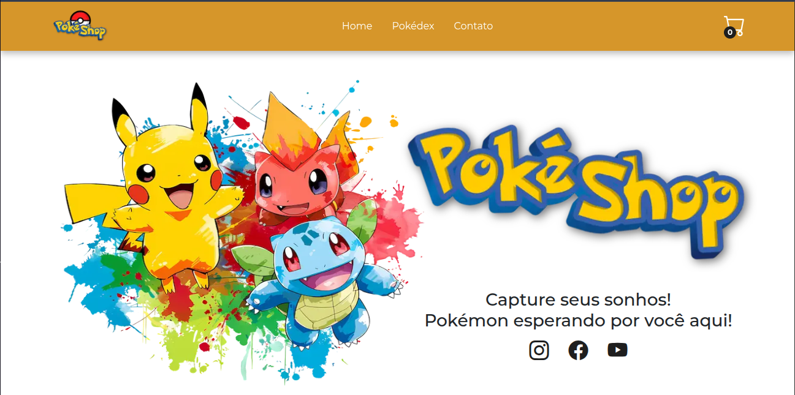

# PokéShop

## 📌 Sobre o Projeto
> PokéShop é uma plataforma interativa de e-commerce com temática Pokémon, desenvolvida para 
> demonstrar na prática meus conhecimentos em tecnologias modernas como Next.js, Zustand, 
> autenticação com NextAuth, entre outras.
> 
> O sistema simula uma loja virtual onde é possível visualizar pokémons, acessar detalhes e 
> adicioná-los ao carrinho — ideal para estudos, portfólio e aprendizado prático com frontend e 
> backend integrados.



## 🚀 Tecnologias Utilizadas

- [Axios](https://axios-http.com/ptbr/docs/intro)
- [Bootstrap Icons](https://icons.getbootstrap.com/)
- [Embla Carousel](https://www.embla-carousel.com/)
- [NextJs](https://nextjs.org)
- [React](https://reactjs.org)
- [React Bootstrap](https://react-bootstrap.netlify.app/)
- [Styled Components](https://styled-components.com)
- [Zustand](https://zustand-demo.pmnd.rs/)

## 📦 Instalação e Configuração

Instruções de como rodar o projeto:

1. Clone o projeto em sua maquina seguindo o modo que você achar melhor;
2. Instale as dependências:

   ```sh
       npm install
   ```

3. Inicie o servidor de desenvolvimento:

   ```sh
      npm run dev
   ```

5. Seu projeto já deve está rodando em localhost.

## 🖼️ Layout

O layout desenvolvido segue um [Figma](https://www.figma.com/design/Qg65ABIOXa3neGXTh9RCCP/Pok%C3%A9Shop?t=z6YE46LbIX335AoP-1) disponibilizado por mim.

## 🚀 Deploy

O projeto utiliza o deploy da [Versel](https://vercel.com), para visualizar o mesmo, por favor [clique aqui!](https://evently-hub.vercel.app/)

## 📝 Licença

[MIT License](https://github.com/RayaniGomes/Evently/blob/main/LICENSE) © [Rayani Gomes](https://github.com/RayaniGomes)
